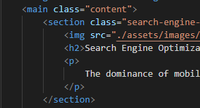

# About the project

## Description

A Marketing Agency website needs to refactor to make it more accessible and a codebase that follows accessibility standards SO their own site is optimized for search engines.

We got a starter code that needs to modify by:
1- Adding a semantic HTML elements so that when we view the structure of the HTML elements we find that the elements follow a logical structure independent of styling and positioning.
2- Adding accessible alt attributes.
3- Consolidate and organize CSS selectors and properties to follow semantic structure.
4. Adding comments to CSS file.

## Instalation

1. Create a new repository on your GitHub account and clone it to your computer.

2. When you're ready to deploy, use the `git add`, `git commit`, and `git push` commands to save and push your code to your GitHub repository.

3. Navigate to your GitHub repository in the browser and then select the Settings tab on the right side of the page.

4. On the Settings page, scroll down to the GitHub Pages section. Then, in the section labeled Source, select the `main` branch as your source.

5. Navigate to <your-github-username.github.io/your-repository-name> and you will find that your new webpage has gone live.

## Usage

. Adding a semantic HTML elements . 
    ```md
    
    
. Adding comments to CSS file 
    ```md
    

. Adding alt attribute 
    ```md
    

. pushing code to git 
    ```md
    gi


