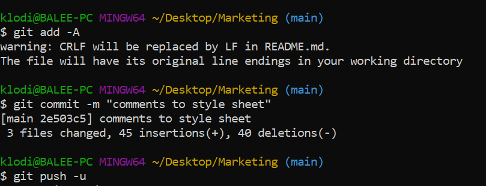

# About the project

## Description

A Marketing Agency website needs to refactor to make it more accessible and a codebase that follows accessibility standards SO their own site is optimized for search engines.

We got a starter code that needs to modify by:
1- Adding a semantic HTML elements so that when we view the structure of the HTML elements we find that the elements follow a logical structure independent of styling and positioning.
2- Adding accessible alt attributes.
3- Consolidate and organize CSS selectors and properties to follow semantic structure.
4. Adding comments to CSS file.

## Instalation

Please use the following link to view the web page after refacroring : https://samer-balee.github.io/Marketing/

Github link : https://github.com/Samer-Balee/Marketing

## Usage

. Adding a semantic HTML elements . 
```md

```    
   
    
. Adding comments to CSS file 
```md

```
   

. Adding alt attribute 
```md

```   
      
    

. pushing code to git 
```md

```
      
 


